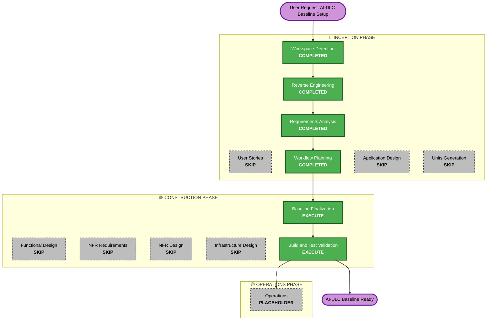

# Execution Plan — ValoCheck AI-DLC Baseline

## Detailed Analysis Summary

### Transformation Scope
- **Transformation Type**: Documentation & Governance Baseline Integration.
- **Primary Changes**: Complete AI-DLC framework setup and state persistence across `aidlc-docs/`.
- **Related Components**: All existing 43 Dart source files and 8 test suites documented; no code modification required.

### Change Impact Assessment
- **User-facing changes**: None (Zero UI changes).
- **Structural changes**: None (Codebase directory structure preserved).
- **Data model changes**: None (All model contracts maintained).
- **API changes**: None (All REST and internal APIs intact).
- **NFR impact**: High positive impact on project documentation, maintainability, and AI assistance consistency.

### Component Relationships
- **Primary Component**: `aidlc-docs/` (AI-DLC Inception, Construction, State, and Audit records).
- **Application Code**: `mobile/lib/` (Untouched, verified).
- **Test Suite**: `mobile/test/` (Untouched, verified).

### Risk Assessment
- **Risk Level**: Low (No application logic or infrastructure modifications).
- **Rollback Complexity**: Easy (Isolated to `aidlc-docs/` directory).
- **Testing Complexity**: Simple (Verification through static analysis and test suite pass).

---

## Workflow Visualization

### Text Alternative for Workflow Visualization
- **INCEPTION PHASE**:
  - Workspace Detection (COMPLETED)
  - Reverse Engineering (COMPLETED)
  - Requirements Analysis (COMPLETED)
  - User Stories (SKIP — baseline governance setup with no user-facing UI changes)
  - Workflow Planning (COMPLETED)
  - Application Design (SKIP — architecture already fully documented)
  - Units Generation (SKIP — single governance unit)
- **CONSTRUCTION PHASE**:
  - Functional Design / NFR Design / Infra Design (SKIP — no code/infra changes)
  - Baseline Finalization (EXECUTE)
  - Build & Test Verification (EXECUTE)
- **OPERATIONS PHASE**:
  - Operations (PLACEHOLDER)

---

## Phases to Execute & Skip Breakdown

### 🔵 INCEPTION PHASE
- [x] **Workspace Detection** (COMPLETED)
- [x] **Reverse Engineering** (COMPLETED)
- [x] **Requirements Analysis** (COMPLETED)
- [ ] **User Stories** — `SKIP`
  - *Rationale*: No new user stories or persona changes are required for setting up the project baseline governance.
- [x] **Workflow Planning** — `IN PROGRESS`
- [ ] **Application Design** — `SKIP`
  - *Rationale*: Existing architecture and service layers are already thoroughly documented in Reverse Engineering.
- [ ] **Units Generation** — `SKIP`
  - *Rationale*: Single governance unit; no multi-module code decomposition required.

### 🟢 CONSTRUCTION PHASE
- [ ] **Functional Design / NFR Design / Infrastructure Design** — `SKIP`
  - *Rationale*: No functional code or infrastructure modifications requested in baseline setup.
- [ ] **Baseline Finalization (Code / Doc Generation)** — `EXECUTE`
  - *Rationale*: Finalize and lock all AI-DLC state tracking files and audit logs.
- [ ] **Build and Test Verification** — `EXECUTE`
  - *Rationale*: Execute Flutter test suite and static analysis validation to guarantee zero regressions.

### 🟡 OPERATIONS PHASE
- [ ] **Operations** — `PLACEHOLDER`
  - *Rationale*: Deployment and production operations workflows.

---

## Success Criteria & Deliverables

1. **Deliverables**:
   - Complete `aidlc-docs/inception/` artifacts (Business Overview, Architecture, Code Structure, APIs, Component Inventory, Tech Stack, Dependencies, Code Quality, Requirements, Execution Plan).
   - Active state tracking file: `aidlc-docs/aidlc-state.md`.
   - Comprehensive audit trail: `aidlc-docs/audit.md`.
2. **Quality Gates**:
   - `flutter analyze` passes with zero warnings.
   - Flutter unit and widget tests pass successfully.
   - Complete traceability of all AI-DLC phases.
