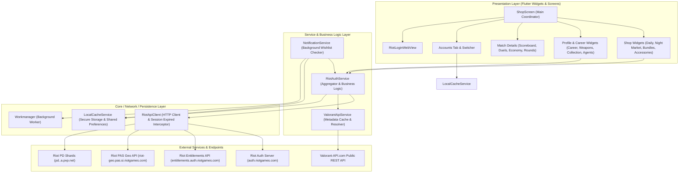
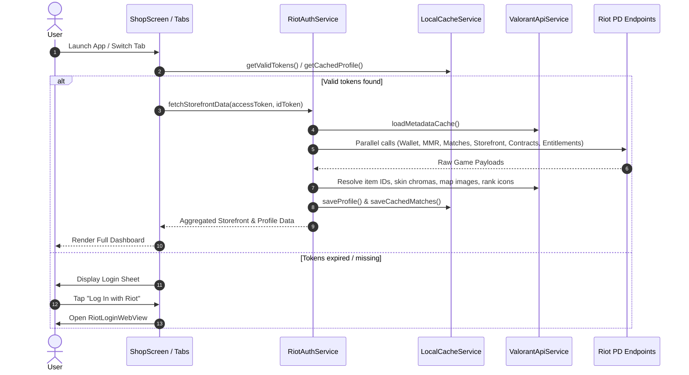

# System Architecture — ValoCheck

## System Overview

ValoCheck is structured as a client-side Flutter mobile application following a clean layered architecture (Presentation Layer -> Business/Service Layer -> Network & Persistence Layer). It communicates with Riot Games private player-data (PD) endpoints and public metadata services (`valorant-api.com`).

---

## Architecture Diagram

### Text Alternative for Architecture Diagram
1. **Presentation Layer**: `ShopScreen` orchestrates UI components including Shop Widgets, Profile & Career Tabs, Match Analysis Modals, and Account Management. `RiotLoginWebView` handles web-based authentication.
2. **Service Layer**: `RiotAuthService` coordinates and aggregates game data; `ValorantApiService` loads and caches game metadata; `NotificationService` handles scheduled alert jobs.
3. **Core / Data Layer**: `RiotApiClient` handles HTTP communications with automatic header injection and error classification. `LocalCacheService` manages device keystore and preferences.
4. **External Services**: Remote endpoints for Riot Auth, Entitlements, PAS Geo routing, PD game data, and Valorant-API metadata.

---

## Component Descriptions

### Application Components

| Component | Responsibility | Dependencies | Type |
| :--- | :--- | :--- | :--- |
| `ShopScreen` | Main application shell, tab switching, global refresh, session state orchestration | `RiotAuthService`, `LocalCacheService`, Sub-widgets | Presentation |
| `RiotLoginWebView` | Interactive OAuth login inside WebView, intercepts tokens from URL fragments | `webview_flutter`, `LocalCacheService` | Presentation |
| `DailyShopTab` / `NightMarketTab` | Display rotational skin offers, calculate countdowns, handle skin modal inspection | `SkinDetailModal`, `SkinItem` model | Presentation |
| `CareerTab` | Renders Rank tier, RR badge, seasonal stats, and list of recent matches | `RankInfo`, `MatchSummary`, `MatchDetailsModal` | Presentation |
| `MatchDetailsModal` | Multi-tab analysis modal for single match (Scoreboard, Duels, Economy, Rounds) | `MatchSummary`, `MatchTeamHelper` | Presentation |
| `WeaponsTab` / `CollectionTab` | Weapon family inventory explorer, inspect chromas, levels, and video previews | `ValorantApiService`, `SkinItem` | Presentation |
| `AccountsTab` | Multi-account management, adding new accounts, switching active session | `LocalCacheService`, `SavedAccount` | Presentation |
| `RiotAuthService` | High-level business aggregation: storefront, wallet, MMR, match history, missions | `RiotApiClient`, `ValorantApiService`, `LocalCacheService` | Service |
| `ValorantApiService` | In-memory metadata caching (skins, agents, tiers, maps, missions, bundles) | `RiotApiClient` | Service |
| `LocalCacheService` | Hardware-backed keystore integration for auth tokens, local storage for cached profile | `flutter_secure_storage`, `shared_preferences` | Core/Persistence |
| `NotificationService` | Workmanager background job dispatcher, daily store vs wishlist evaluator | `flutter_local_notifications`, `workmanager`, `RiotAuthService` | Core/Service |
| `RiotApiClient` | HTTP client wrapper with client-version header sync, timeout, error logging | `http`, `package:flutter/foundation.dart` | Network |

---

## Data Flow

---

## Integration Points

### External APIs
1. **Riot Sign-On (RSO)**: `https://auth.riotgames.com/userinfo`
2. **Riot Entitlements API**: `https://entitlements.auth.riotgames.com/api/token/v1`
3. **Riot PAS (Player Affinity Service)**: `https://riot-geo.pas.si.riotgames.com/pas/v1/product/valorant`
4. **Riot Player Data (PD) APIs**: `https://pd.{shard}.a.pvp.net/`
   - `/store/v3/storefront/{puuid}`: Daily shop, Night Market, bundles, accessory store.
   - `/store/v1/wallet/{puuid}`: VP, Radianite, Kingdom Credits balances.
   - `/store/v1/entitlements/{puuid}/{itemType}`: Owned inventory and agents.
   - `/mmr/v1/players/{puuid}` & `/competitiveupdates`: Rank tier, RR, peak MMR, match updates.
   - `/match-history/v1/history/{puuid}` & `/match-details/v1/matches/{matchId}`: Match history and round scoreboards.
   - `/contracts/v1/contracts/{puuid}`: Missions and battle pass progress.
   - `/name-service/v2/players`: Player IGN and Tagline resolution.
5. **Valorant-API.com**: `https://valorant-api.com/v1/` (skins, skin levels, content tiers, bundles, sprays, player cards, buddies, titles, competitive tiers, agents, maps, missions, seasons).

### Persistence & Storage
- **Flutter Secure Storage**: Hardware-backed keystore/keychain for sensitive OAuth credentials.
- **Shared Preferences**: Fast KV store for local profile caches, wishlist IDs, active account identifiers.

---

## Deployment & Execution Model

- **Target Platforms**: Android (APK / App Bundle AAB) & iOS (IPA).
- **Execution Lifecycle**: Runs on-device with asynchronous background polling via Workmanager every 12 hours for wishlist alerts.
- **No Custom Backend Required**: Pure client-to-API serverless architecture with direct secure HTTPS calls from the mobile device to Riot and Valorant-API.
