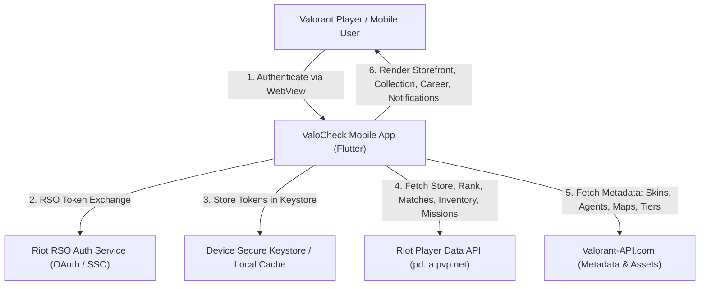

# Business Overview — ValoCheck

## Business Context Diagram

### Text Alternative for Business Context Diagram
- **User / Player** interacts with the ValoCheck Mobile Application.
- **ValoCheck App** authenticates the player securely via Riot Sign-On (RSO) inside an in-app WebView.
- Tokens are safely persisted in device Secure Storage (Android Keystore / iOS Keychain) and local cache.
- The app queries **Riot Player Data (PD) API** for user-specific real-time data: Daily 4-skin Store, Night Market, Accessory Store, Featured Bundles, Wallet balances (VP, Radianite, Kingdom Credits), Career Rank & RR history, Match history & scoreboards, Active Missions/Contracts, and Inventory.
- The app merges this raw data with static metadata and rich media from **Valorant-API.com** (skin chromas, video previews, agent lore, weapon models, rank tier badges, map splashes).
- Results and background wishlist notifications are presented to the user.

---

## Business Description

- **Overall Business Purpose**: ValoCheck is a specialized companion utility application designed for Valorant players to manage, monitor, and explore their game status directly from mobile devices without needing to launch the PC game client.
- **Core Value Proposition**:
  - **Shop Checking On-the-Go**: Valorant skin offers rotate daily and during special events (Night Market). Players often miss rare skins they desire because they cannot access their gaming PC daily. ValoCheck solves this with instant store viewing, countdown timers, and automated wishlist push notifications.
  - **Career & Performance Tracking**: Provides mobile access to competitive rank, RR progression history, detailed match breakdown (ACS, ADR, HS%, First Kills, economy, round timeline), and contract/mission progress.
  - **Collection & Agent Lore Browser**: Complete weapon skin family explorer with levels, chromas, preview videos, and agent ability breakdowns.
  - **Multi-Account Support**: Frictionless account switching with secure credential management and persistent SSO cookies for quick 1-tap re-authentication.

---

## Business Transactions

1. **Riot Account Authentication & Session Management**:
   - Authenticate via official Riot Sign-On (RSO) web interface.
   - Secure extraction and storage of `accessToken`, `idToken`, `entitlementsToken`, and user `puuid`.
   - Silent session refresh and re-auth handling via retained SSO cookies without exposing passwords.

2. **Daily Store & Night Market Exploration**:
   - Retrieve 4 daily rotational weapon skins with remaining duration countdown.
   - Retrieve promotional Night Market bonus offers with discount percentages and original prices.
   - Cross-check owned status (`OWNED` badge) against player inventory.

3. **Featured Bundles & Accessory Store Lookup**:
   - Retrieve active featured weapon bundles, calculate total/discounted prices, and display bundle components.
   - Retrieve Kingdom Credits accessory store offers with reset timers.

4. **Wishlist Tracking & Background Notifications**:
   - Allow users to add desired skins to a local Wishlist.
   - Run periodic background tasks via `Workmanager` and `FlutterLocalNotifications` to check daily store offers against the wishlist and trigger alerts when matches appear.

5. **Competitive Career & MMR Analysis**:
   - Fetch MMR stats, current rank tier, current Ranked Rating (RR), peak historical tier, and seasonal win counts.
   - Display chronological competitive updates with delta RR (+/-) per match and tier changes.

6. **Match Scoreboard & Timeline Breakdown**:
   - Fetch recent 20 match history records.
   - Render multi-tab match insights: Scoreboard, Performance/KDA, Economy per round, Opening Duels (FK/FD), and Round-by-Round timeline.

7. **Inventory & Weapons Catalog Browsing**:
   - Catalog owned skins grouped by weapon categories (Sidearms, SMGs, Shotguns, Rifles, Snipers, Heavies, Melee).
   - Display level progression, chroma variations, and streamable demo videos.

8. **Agent Roster & Contract Progression**:
   - View all playable agents, ownership status, role classifications (Duelist, Initiator, Controller, Sentinel), abilities, and voice lore.

---

## Business Dictionary

| Business Term | Definition |
| :--- | :--- |
| **VP (Valorant Points)** | Premium currency purchased with real money, used for weapon skins, bundles, and battle passes. |
| **Radianite Points (RAD)** | Currency used to evolve skin levels (animations, VFX, finishers) and unlock color chromas. |
| **Kingdom Credits (KC)** | Free earned currency used to unlock accessories and agent contracts in the Accessory Store. |
| **Night Market** | A periodic recurring event offering 6 random discounted skins unique to each player. |
| **Entitlements** | Player ownership records on Riot's backend identifying unlocked skins, agents, sprays, and player cards. |
| **RR (Ranked Rating)** | The numerical progression score (0-100) within a competitive rank tier. |
| **PUUID** | Globally unique Player UUID assigned by Riot Games to identify user accounts. |
| **Shard / Region** | Geographical routing cluster (`ap`, `eu`, `na`, `kr`) hosting the player's account data. |
| **Wishlist** | User-configured list of monitored skin items that triggers notifications when present in the daily store. |

---

## Component Level Business Descriptions

### `mobile/lib/services/`
- **`RiotAuthService`**: Handles RSO auth token exchanges, entitlement retrieval, shard geo-resolution, storefront fetching, MMR tracking, match history retrieval, and inventory aggregation.
- **`ValorantApiService`**: Communicates with public `valorant-api.com` endpoints to cache static metadata, resolve IDs into human-readable names, icons, tiers, and video URLs.
- **`LocalCacheService`**: Provides hardware-backed secure storage for OAuth tokens, account switching lists, wishlists, and cached profile data for offline resilience.
- **`NotificationService`**: Schedules background tasks with Workmanager and dispatches system notifications for store alerts.
- **`RiotApiClient`**: Centralized HTTP client enforcing timeout rules, Riot client version synchronization, and session expiration interceptors.

### `mobile/lib/screens/`
- **`ShopScreen`**: Primary container view coordinating the main bottom tabs (Store, Collection, Career, Agents, Accounts), state management, pull-to-refresh, and sub-tab routing.
- **`RiotLoginWebView`**: Dedicated secure WebView handling Riot OAuth interactive login and intercepting token redirection URLs.

### `mobile/lib/widgets/`
- **`shop/`**: Daily shop grid, Night Market discount cards, Accessory store, Featured bundle details, and skin inspection modals.
- **`profile/`**: Career summary, MMR chart, match list, collection grid, and agent detail modal.
- **`match/`**: In-depth modal with Scoreboard, Performance, Economy, Duels, and Rounds tabs.
- **`accounts/`**: Multi-account management sheet, account switcher, and active account indicator.
