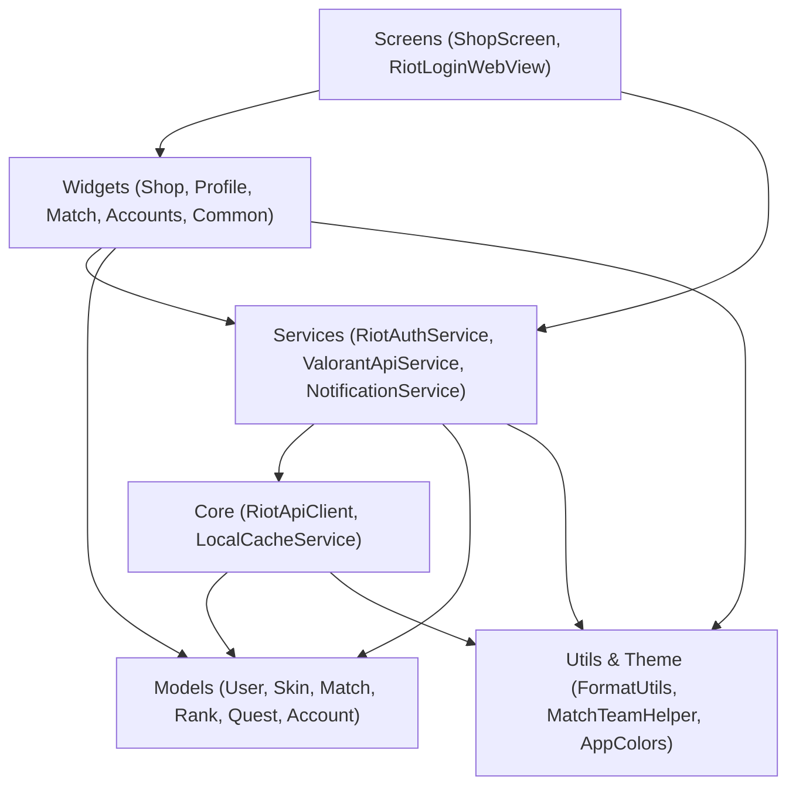

# Dependencies — ValoCheck

## Internal Module Dependencies

### Text Alternative for Internal Dependencies
- **Screens** depend on **Widgets**, **Services**, and **Models**.
- **Widgets** depend on **Services**, **Models**, and **Utils/Theme**.
- **Services** depend on **Core** (`RiotApiClient`, `LocalCacheService`), **Models**, and **Utils**.
- **Core** depends on **Models** and low-level SDKs.

---

## Internal Dependency Mapping

| Source File | Target Dependency | Dependency Type | Reason |
| :--- | :--- | :--- | :--- |
| `main.dart` | `NotificationService`, `ShopScreen`, `AppColors` | Runtime / Compile | Bootstraps notification worker, applies global theme, displays root screen |
| `shop_screen.dart` | `RiotAuthService`, `LocalCacheService`, All Tab Widgets | Compile / Runtime | Coordinates tab state, fetches storefront data, handles session re-login |
| `riot_auth_service.dart` | `RiotApiClient`, `ValorantApiService`, `LocalCacheService`, Models | Compile / Runtime | Aggregates player endpoints, calls metadata resolver, persists match history |
| `valorant_api_service.dart` | `RiotApiClient`, `SkinItem`, `AccessoryItem` | Compile / Runtime | Caches and transforms raw JSON payloads into domain models |
| `notification_service.dart` | `Workmanager`, `FlutterLocalNotifications`, `RiotAuthService` | Compile / Runtime | Performs periodic store check against wishlists in background |
| `match_details_modal.dart` | `MatchTeamHelper`, `MatchSummary`, Sub-tab Widgets | Compile / Runtime | Calculates team scoreboards and renders round analytics |

---

## External Dependencies

| Package / Library | Version | Purpose | License |
| :--- | :--- | :--- | :--- |
| `flutter` | SDK | Cross-platform core framework | BSD-3-Clause |
| `cupertino_icons` | `^1.0.8` | iOS style icons | MIT |
| `webview_flutter` | `^4.10.0` | In-app OAuth authentication webview | BSD-3-Clause |
| `http` | `^1.2.1` | Asynchronous HTTP requests | BSD-3-Clause |
| `shared_preferences` | `^2.2.3` | Local key-value store for profiles & wishlists | BSD-3-Clause |
| `flutter_secure_storage` | `^10.3.1` | Hardware-backed keystore token encryption | BSD-3-Clause |
| `google_fonts` | `^6.2.1` | Inter typography font loading | Apache-2.0 |
| `cached_network_image` | `^3.3.1` | Image caching for skins, maps, agents | MIT |
| `flutter_local_notifications` | `^18.0.1` | System notification triggers | BSD-3-Clause |
| `workmanager` | `^0.10.6` | Background execution management | MIT |
| `flutter_lints` | `^6.0.0` | Official Flutter static analysis linter | BSD-3-Clause |
| `flutter_launcher_icons` | `^0.14.4` | App icon generation tool | MIT |
